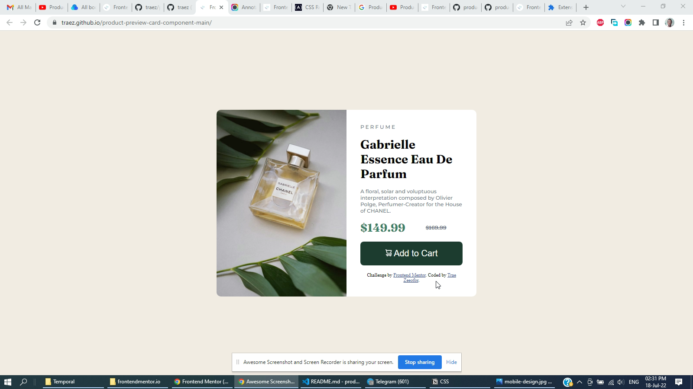

# Frontend Mentor - Product preview card component solution

This is a solution to the [Product preview card component challenge on Frontend Mentor](https://www.frontendmentor.io/challenges/product-preview-card-component-GO7UmttRfa). Frontend Mentor challenges help you improve your coding skills by building realistic projects. 

## Table of contents

- [Overview](#overview)
  - [The challenge](#the-challenge)
  - [Screenshot](#screenshot)
  - [Links](#links)
- [My process](#my-process)
  - [Built with](#built-with)
  - [What I learned](#what-i-learned)
  - [Continued development](#continued-development)
  - [Useful resources](#useful-resources)
- [Author](#author)
- [Acknowledgments](#acknowledgments)

## Overview

### The challenge

Users should be able to:

- View the optimal layout depending on their device's screen size
- See hover and focus states for interactive elements

### Screenshot

### Links

- Solution URL: [https://github.com/traez/product-preview-card-component-main](https://github.com/traez/product-preview-card-component-main)
- Live Site URL: [https://traez.github.io/product-preview-card-component-main/](https://traez.github.io/product-preview-card-component-main/)

## My process

### Built with

- Semantic HTML5 markup
- CSS custom properties
- Flexbox
- Mobile-first workflow considered

### What I learned

1 Semantic HTML use on my mind while developing and I adhered as uch as possible  
2 Cut my teeth in Responsiveness design with this one. Looking forward to more practice.  
3 So much element styling for CSS. proud that i took care of a vast majority of concerns on my own.  

### Continued development

Practice repeat(daily 8hours-min). Practice makes perfect, so will keep at it.

### Useful resources

- [DrMESAZIM](https://github.com/DrMESAZIM/product-preview) - Provided inspiration to help me complete project after I got stuck (Flex-box and Media Query)

## Author

- Website - [Trae Zeeofor](https://github.com/traez)
- Frontend Mentor - [@traez](https://www.frontendmentor.io/profile/traez)
- Twitter - [@trae_z](https://twitter.com/trae_z)

## Acknowledgments

To Jah Almighty for keeping breathe in my lungs. #Respect!
